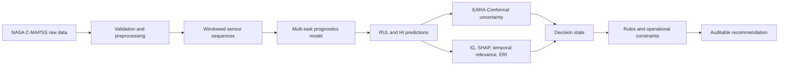

device: cuda  # or cpu
# PHM-XAI

An experimental, end-to-end prognostics pipeline for **remaining useful life (RUL)** and **health index (HI)** estimation on the NASA C-MAPSS turbofan dataset. The project extends point predictions with uncertainty estimates, post-hoc explanations, and constraint-aware maintenance recommendations.

The repository is intended for research and engineering evaluation. Reported results are project runs on C-MAPSS, not a claim of production readiness or universal state-of-the-art performance.

## What the system does



The main processing stages are:

1. Load and validate FD001, FD002, FD003, or FD004.
2. Generate capped RUL and normalized HI labels, select features, scale data, and create sliding windows.
3. Train a model with shared representations and RUL/HI prediction heads.
4. Evaluate point predictions with MAE, RMSE, R², and NASA Score.
5. Calibrate engine-disjoint conformal intervals for RUL.
6. Produce sensor and temporal explanations for RUL and HI.
7. Fuse RUL, HI, interval width, ERI, and operational constraints into a maintenance recommendation.

## Proposed system

The proposed workflow is a layered decision-support system rather than a fully autonomous maintenance controller:

- **Prognostics:** LSTM, GRU, Transformer, TCN+GRU Hybrid, and GRU-Att-Deg models support joint RUL and HI estimation.
- **Uncertainty:** EARA-Conformal combines a heteroscedastic scale head with k-means operating-regime calibration. Calibration is engine-disjoint from training and test data.
- **Explainability:** Integrated Gradients and sensor-level Kernel SHAP are combined with temporal gradient relevance. ERI summarizes agreement between explanation methods.
- **Decision support:** A rule-based engine classifies health and uncertainty, applies operational constraints, and flags ambiguous cases for human review.

The decision engine is deliberately auditable: each result includes inputs, health state, uncertainty level, risk components, reasons, constraint violations, and the recommended action.

## Architecture

```text
data/raw/                  NASA C-MAPSS text files (not committed)
    |
src/preprocessing/         validation, labels, feature selection, scaling, windows
    |
data/processed/            NumPy windows, labels, engine IDs, metadata (local)
    |
src/models/                LSTM, GRU, Transformer, Hybrid, GRU-Att-Deg
    |
outputs/checkpoints/       best model checkpoints (local)
    |
  +-----+----------------------+------------------+
  |                            |                  |
src/uncertainty/       src/explainability/  src/decision_engine/
  |                            |                  |
RUL intervals          attributions + ERI   recommendations + constraints
  +----------------------------+------------------+
                   |
              outputs/results, reports,
              figures, xai, and logs
```

## Methodology

### Data and labels

NASA C-MAPSS contains multivariate engine run-to-failure trajectories under four operating and fault-condition subsets. The preprocessing pipeline validates the frames, removes near-constant features, scales retained features, and forms fixed-length windows. The current training pipeline uses a 40-cycle window; experiment reports also contain earlier 30-cycle runs, so reproduce a result with the matching generated data and configuration.

Training labels use a piecewise-linear RUL target capped at 125 cycles. HI is normalized to the range `[0, 1]` and learned as an auxiliary target.

### Multi-task models

The models share a sequence encoder and predict RUL and HI together. The GRU-Att-Deg variant adds temporal attention, a degradation-aware HI head, and a softplus scale head used by the uncertainty pipeline. Training uses grouped engine-level validation so windows from one engine do not cross the train/validation boundary.

### Uncertainty and explanations

EARA-Conformal fits regimes on training-engine features, calibrates normalized residuals on held-out calibration engines, and produces adaptive RUL intervals. The current implementation evaluates empirical coverage, coverage error, MPIW, PINAW, and per-regime coverage.

The XAI pipeline generates Integrated Gradients, Kernel SHAP, temporal relevance, plots, `.npz` attribution arrays, ERI JSON, and HTML reports for RUL and HI targets.

## Quick setup

### 1. Install

Python 3.9+ is recommended. On Windows PowerShell:

```powershell
python -m venv .venv
.venv\Scripts\Activate.ps1
python -m pip install --upgrade pip
pip install -r requirements.txt
```

`requirements.txt` currently pins a CUDA 12.8 PyTorch build. Use a compatible PyTorch build for a CPU-only or different CUDA environment, then install the remaining requirements.

### 2. Add the dataset

The raw NASA C-MAPSS files are not included. Place all four subsets in `data/raw/`:

```text
data/raw/
├── train_FD001.txt       test_FD001.txt       RUL_FD001.txt
├── train_FD002.txt       test_FD002.txt       RUL_FD002.txt
├── train_FD003.txt       test_FD003.txt       RUL_FD003.txt
└── train_FD004.txt       test_FD004.txt       RUL_FD004.txt
```

### 3. Run the pipeline

```powershell
# Exploratory data analysis for FD001
python main.py

# Preprocess one subset, or use --subset all
python scripts/preprocess.py --subset FD001

# Train and evaluate a model
python scripts/train.py --model gru --subset FD001
python scripts/evaluate.py --model gru --subset FD001

# RUL uncertainty intervals
python scripts/uncertainty.py --model gru --subset FD001 --n_regimes 7

# XAI for one target; use --subset all --model all --target all for a full run
python scripts/explain.py --model gru_att_deg --subset FD001 --target rul
```

Most stages require processed arrays and/or a trained checkpoint from the previous stage. Model and subset names are `lstm`, `gru`, `transformer`, `hybrid`, `gru_att_deg` and `FD001`–`FD004`.

### 4. Run decision support

The decision engine accepts one record, a list of records, or an object containing a `records` list. Example inputs are provided in `data/external/`.

```powershell
python scripts/decision.py --subset all

python scripts/decision.py `
  --subset FD001 `
  --minimum-safe-rul 10 `
  --maintenance-lead-time 10 `
  --no-maintenance-window
```

Each record should contain `rul`, `hi`, `rul_lower`, `rul_upper`, and `eri`; `top_k_sensors` and engine identifiers are optional. Results are written under `outputs/results/` and human-readable reports under `outputs/reports/`.

## Current progress

The following status reflects the project reports and implemented modules:

| Area | Status | Current evidence |
| --- | --- | --- |
| Preprocessing and window generation | Implemented | Validation, labeling, scaling, feature selection, and engine metadata are present. |
| Joint RUL/HI prediction | Implemented and evaluated | Five model families evaluated on FD001–FD004 in the project reports. |
| Uncertainty quantification | Implemented and evaluated | Split, adaptive, CQR, and EARA-Conformal components are present; the current uncertainty script defaults to 7 regimes. |
| Explainability | Implemented and evaluated | IG, SHAP, temporal relevance, ERI, plots, and HTML reporting are present. |
| Decision support | Implemented and tested | Rules, constraints, structured JSON results, HTML reports, and decision tests are present. |
| HITL updating | In progress | HITL modules exist, but the feedback/update loop still needs broader end-to-end validation. |
| Publication-grade validation | In progress | Multi-seed stability, ablations, faithfulness checks, and external-dataset validation remain open items. |

## Selected findings

These are compact excerpts from the local project reports, included to make the current state visible without presenting every experiment:

- **Point prediction:** On the reported FD001 run, GRU-Att-Deg achieved RUL MAE `10.050`, RUL RMSE `13.644`, R² `0.884`, and NASA Score `308.63`. On FD004, the reported Transformer run was strongest among the evaluated models with RUL MAE `13.559` and R² `0.808`.
- **Uncertainty:** At 90% nominal coverage, the reported EARA-Conformal results were `0.870` on FD001, `0.897` on FD002, `0.850` on FD003, and `0.928` on FD004. Reported MPIW values were `35.02`, `51.10`, `31.29`, and `56.04` cycles respectively.
- **Explainability:** The reported mean ERI was `0.880` for HI and `0.872` for RUL across the four subsets and five models. FD003 showed weaker explanation agreement than the other subsets, so its explanations should be reviewed more cautiously.
- **Decision support:** The engine produces explicit actions such as `CONTINUE_OPERATION`, `INSPECT`, `SCHEDULE_MAINTENANCE`, and `URGENT_MAINTENANCE`, with constraint overrides and human-review flags instead of hiding those decisions in a single score.

The numbers above depend on the data preprocessing, checkpoint, seed, and report run. Re-run the relevant scripts before using them as a formal comparison.

## Outputs and repository hygiene

Generated artifacts are intentionally local. The ignore rules exclude `outputs/`, raw and processed data, checkpoints, logs, `docs/`, virtual environments, and archives from version control. Typical generated locations are:

```text
outputs/
├── checkpoints/   trained model weights
├── figures/       EDA and experiment plots
├── logs/          pipeline logs
├── models/        scalers and related artifacts
├── reports/       CSV and HTML reports
├── results/       metrics, predictions, intervals, decisions
└── xai/           attribution arrays, plots, ERI, HTML reports
```

The tracked source of truth is the code, configuration, tests, and this README. Local reports under `docs/` are useful for reproducing project context but are not distributed by Git according to the current `.gitignore`.

## Tests

Run the test suite from the repository root:

```powershell
python -m pytest -q
```

Some integration paths require generated processed data or checkpoints. A clean checkout therefore needs the dataset and the corresponding pipeline stages before those paths can run.

## Repository layout

```text
configs/       subset configuration files
data/          external inputs, raw data, and processed arrays
scripts/       EDA, preprocessing, training, evaluation, XAI, UQ, and decisions
src/           reusable preprocessing, models, uncertainty, XAI, HITL, and decision code
tests/         preprocessing, model, uncertainty, XAI, and decision tests
docs/          local architecture, methodology, and objective reports
outputs/       generated artifacts; ignored by Git
```

See `requirements.txt` for the complete dependency list.
